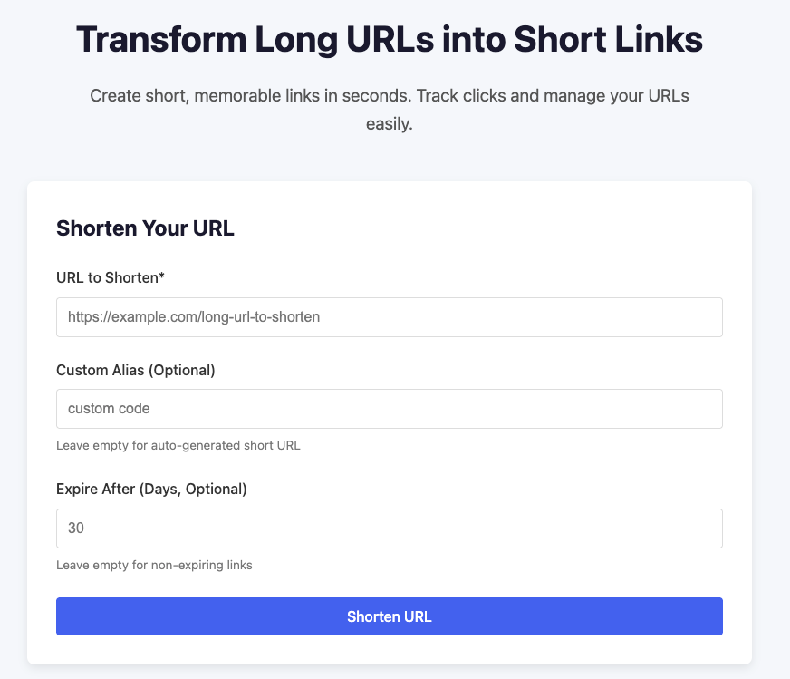

# URL Shortener Service

A lightweight, scalable URL shortening service built with Java Spring Boot, MySQL, and ReactJs.

### Features:

- Shorten URLs: Convert long URLs into short, unique codes. e.g. http://server/abc23
- Redirect: Access short URLs to redirect to the original long URL.
- Persistence: Stores URL mappings in MYSQL

### Tech Stack
- Backend: Java Spring Boot
- Database: MySQL
- Frontend: React

screenshot

